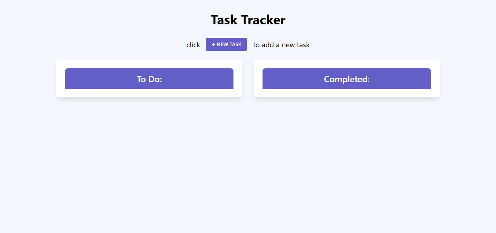
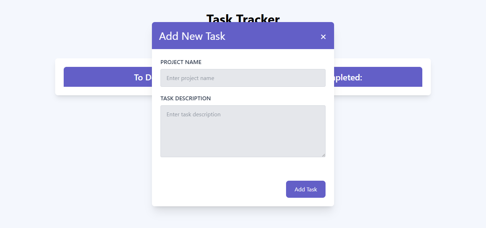
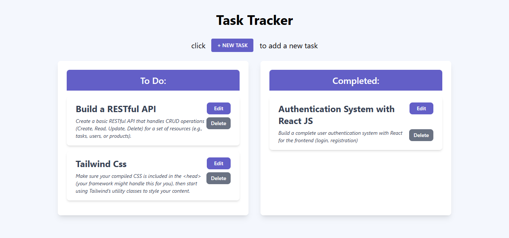

# 🚀 Tracker

Tracker is a simple task management web application built using **React**, **Tailwind CSS**, and **React DnD**. It allows users to create, edit, and delete tasks while leveraging **drag-and-drop functionality** for task management. The application also uses **local storage** to persist tasks between sessions.

## ✨ Features

✅ **Add Tasks**: Users can create new tasks with a title and description.

✅ **Edit Tasks**: Users can modify existing tasks using a modal.

✅ **Delete Tasks**: Tasks can be permanently removed.

✅ **🎯 Drag & Drop**: Move tasks between sections using drag-and-drop.

✅ **💾 Local Storage Support**: All tasks are saved locally to prevent data loss.

✅ **📱 Responsive UI**: Styled with Tailwind CSS for a modern look and mobile-friendly experience.

---

## 📸 Preview







## 🛠 Technologies Used

- ⚛️ **React** (Component-based UI)
- 🎨 **Tailwind CSS** (Styling)
- 🖱 **React DnD** (Drag and drop functionality)
- 💾 **Local Storage** (Data persistence)

---

## 📥 Installation

1. Clone the repository:

   ```sh
   git clone https://github.com/esraarabee1/Tracker.git
   cd TracerTask
   ```

2. Install dependencies:

   ```sh
   npm install
   ```

3. Start the development server:
   ```sh
   npm run dev
   ```

---

## 🎮 Usage

1. 📝 Click **Add Task** to create a new task.
2. ✏️ Edit or 🗑 Delete a task using the respective buttons.
3. 🔄 Drag and drop tasks between the **To-Do** and **Completed** sections.
4. 🔄 Refresh the page, and your tasks will persist!

---
```
